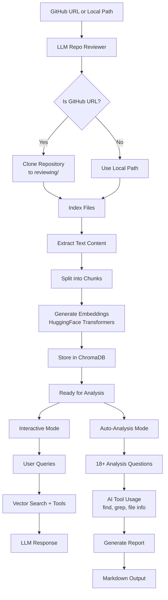
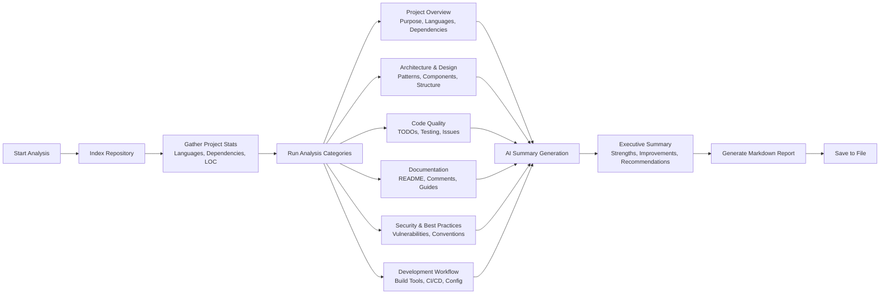
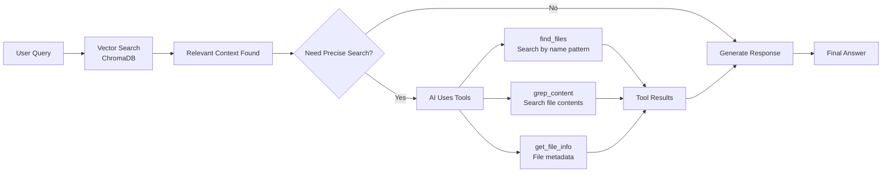

# LLM Repo Reviewer

An AI-powered repository analysis and code review tool that indexes codebases and provides intelligent analysis using ChromaDB for vector storage and OpenAI-compatible APIs.

## Features

- 🚀 **ChromaDB Vector Storage**: Fast and scalable semantic search
- 🔧 **Tool Calling**: AI can use `find` and `grep` commands for precise searches
- 📊 **Auto-Analysis**: Comprehensive automated repository analysis with reports
- 🐙 **GitHub Integration**: Clone and analyze repositories directly from GitHub URLs
- 💾 **Smart Caching**: Only reprocess changed files
- 📚 **Multiple File Types**: Python, JavaScript, Markdown, PDF, YAML, JSON, and more
- 🤖 **OpenAI-Compatible**: Works with local LLMs (Ollama, llama.cpp, etc.)
- 🔍 **Interactive CLI**: Real-time Q&A about your codebase

## How It Works

### Architecture Overview



### Analysis Process Flow



### Tool Integration



## Installation

```bash
pip install -e .
```

## Quick Start

### Interactive Mode
```bash
# Analyze a local directory
llm-repo-reviewer ~/my-project

# Analyze a GitHub repository
llm-repo-reviewer https://github.com/user/repo

# GitHub URL variations supported:
llm-repo-reviewer github.com/user/repo
llm-repo-reviewer git@github.com:user/repo.git
```

### Auto-Analysis Mode
```bash
# Generate comprehensive analysis report for local directory
llm-repo-reviewer --auto-analyze ~/my-project

# Analyze GitHub repository and generate report
llm-repo-reviewer --auto-analyze https://github.com/user/repo

# Custom output file
llm-repo-reviewer --auto-analyze --output custom_report.md github.com/user/repo
```

## Configuration

### API Configuration

The tool uses OpenAI-compatible APIs. Configure your endpoint:

```bash
# For local Ollama server
export OPENAI_API_BASE="http://localhost:11434/v1"

# For OpenAI
export OPENAI_API_KEY="your-api-key"
export OPENAI_API_BASE="https://api.openai.com/v1"
```

### Command Line Options

```bash
llm-repo-reviewer [OPTIONS] [TARGET]

Arguments:
  TARGET                  Directory path or GitHub URL to analyze

Options:
  --api-base URL          OpenAI-compatible API base URL
  --api-key KEY           API key
  --embedding-model NAME  HuggingFace embedding model (default: all-MiniLM-L6-v2)
  --chunk-size SIZE       Text chunk size (default: 1000)
  --chunk-overlap SIZE    Chunk overlap (default: 200)
  --collection NAME       ChromaDB collection prefix
  --auto-analyze          Automatically analyze codebase and generate report
  --output FILE           Output file for analysis report (default: [repo]_analysis_report.md)
  -v, --verbose           Enable verbose output
  --no-interactive        Exit after indexing
```

## Interactive Commands

Once in interactive mode:

- **Ask questions**: Type naturally to query your codebase
- `/tools on|off`: Enable/disable AI tool usage (find, grep)
- `/history`: View recent queries
- `/reindex <path>`: Reindex a directory
- `/quit` or `/exit`: Exit the program

## Example Usage

### Interactive Mode
```bash
# Analyze a Python project from GitHub
llm-repo-reviewer https://github.com/python/cpython

# Query examples:
🔍 Query: What is the main purpose of this project?
🔍 Query: Find all test files
🔍 Query: Show me the core parsing logic
🔍 Query: Search for all TODO comments
🔍 Query: How is memory management handled?
```

### Auto-Analysis Mode
```bash
# Generate comprehensive analysis report
llm-repo-reviewer --auto-analyze https://github.com/fastapi/fastapi

# This automatically:
# 1. Clones the repository to reviewing/fastapi/
# 2. Indexes the entire codebase with smart caching
# 3. Runs 18+ analysis questions across 6 categories:
#    - Project Overview
#    - Architecture & Design
#    - Code Quality
#    - Documentation
#    - Security & Best Practices
#    - Development Workflow
# 4. Uses AI tools (find, grep, file info) for precise analysis
# 5. Generates executive summary with actionable recommendations
# 6. Outputs structured markdown report: fastapi_analysis_report.md
```

## Tools Available to AI

The AI has access to system tools for precise analysis:

1. **find_files**: Search for files by name pattern
2. **grep_content**: Search file contents with regex
3. **get_file_info**: Get file metadata and statistics

## File Organization

- **reviewing/**: Directory where cloned repositories are stored (gitignored)
- **[repo]_analysis_report.md**: Generated analysis reports (gitignored)

## Development

### Running Tests

```bash
pytest tests/
pytest tests/test_repo_reviewer.py -v
```

### Code Quality

```bash
ruff check src/
mypy src/
```

## Architecture

- **ChromaDB**: Vector database for embeddings
- **LangChain**: Text splitting and document processing
- **Sentence Transformers**: Generate embeddings locally
- **GitPython**: Repository cloning and management
- **OpenAI API**: Compatible with any LLM server

## Examples

See the `examples/` directory:
- `demo.ipynb`: Jupyter notebook demonstrating features

## Use Cases

Perfect for:
- **Code Reviews**: Automated comprehensive analysis of pull requests
- **Due Diligence**: Quick assessment of open source libraries or acquired codebases
- **Onboarding**: Help new team members understand project architecture
- **Documentation**: Generate architecture and quality reports
- **Security Audits**: Identify potential vulnerabilities and best practice violations
- **Technical Debt**: Find areas needing improvement and refactoring

## License

MIT License - see LICENSE file for details.
