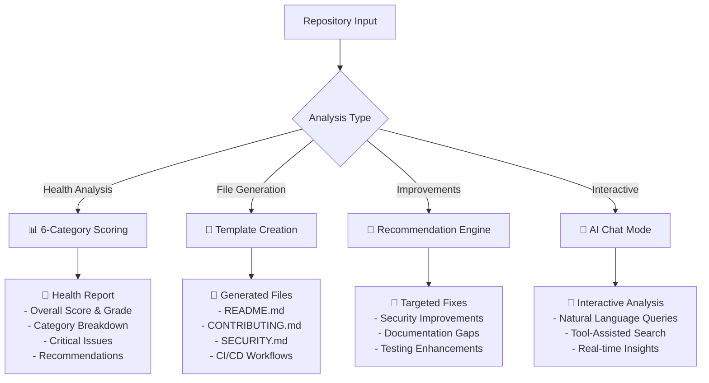
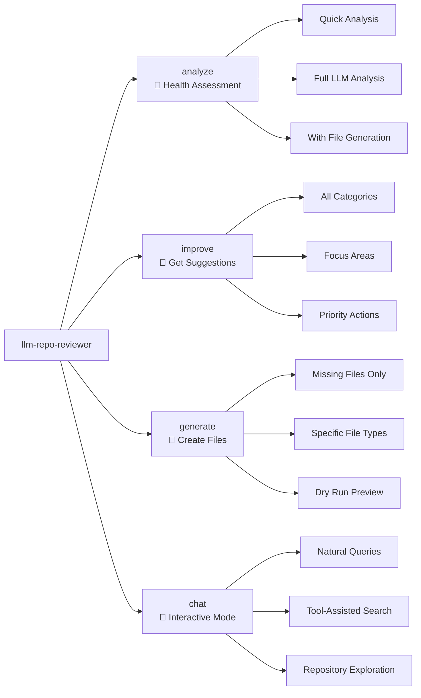
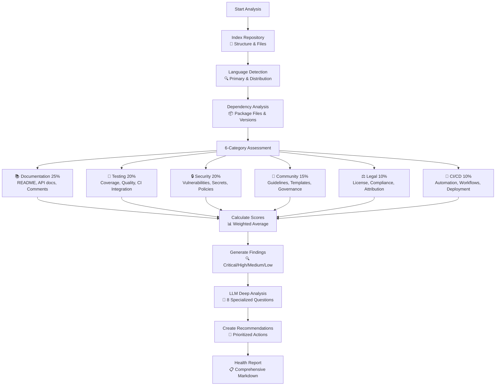

# 🏥 Repository Health Analyzer

An AI-powered comprehensive repository health analysis and quality assessment tool that provides automated scoring, missing file generation, and intelligent recommendations using ChromaDB for vector storage and OpenAI-compatible APIs.

## ✨ Features

- 🏥 **6-Category Health Assessment**: Documentation (25%), Testing (20%), Security (20%), Community (15%), Legal (10%), CI/CD (10%)
- 🛠️ **Intelligent File Generation**: Auto-generate missing repository files with language-specific templates
- 🤖 **LLM-Powered Analysis**: 4 specialized tools for comprehensive repository evaluation
- 📊 **Detailed Scoring & Reports**: Letter grades, findings, and actionable recommendations
- 🚀 **Modern CLI Interface**: Intuitive subcommands for different analysis workflows
- 🐙 **GitHub Integration**: Clone and analyze repositories directly from GitHub URLs
- 💾 **Smart Caching**: ChromaDB vector storage with SHA256-based file change detection
- 🔧 **Tool Calling**: AI can execute system commands for precise repository exploration
- 📚 **Multiple File Types**: Python, JavaScript, Rust, Java, Markdown, PDF, YAML, JSON, and more

## 🎯 What It Does

The Repository Health Analyzer transforms your codebase evaluation from manual review to automated, comprehensive assessment:



## 🏗️ System Architecture

```mermaid
graph TB
    subgraph "Input Sources"
        A[Local Repository]
        B[GitHub URL]
        C[git@github.com:user/repo.git]
    end

    subgraph "Core Engine"
        D[Repository Health Analyzer]
        E[ChromaDB Vector Store]
        F[HuggingFace Embeddings]
        G[OpenAI-Compatible LLM]
    end

    subgraph "Analysis Components"
        H[Repository Indexer<br/>📁 Structure & Metadata]
        I[Quality Scorer<br/>⚡ 6-Category Scoring]
        J[Template Manager<br/>📝 File Generation]
        K[Health Assessment<br/>📋 Report Creation]
    end

    subgraph "LLM Tools"
        L[Health Analysis Tools<br/>🔍 4 Specialized Tools]
        M[File System Tools<br/>📂 find, grep, info]
        N[Template Tools<br/>🛠️ Generation & Preview]
    end

    subgraph "Output"
        O[Health Report<br/>📊 Markdown + Scores]
        P[Generated Files<br/>📄 Standards Compliant]
        Q[Improvement Plan<br/>🎯 Prioritized Actions]
    end

    A --> D
    B --> D
    C --> D

    D --> E
    D --> F
    D --> G

    D --> H
    D --> I
    D --> J
    D --> K

    G --> L
    G --> M
    G --> N

    H --> O
    I --> O
    J --> P
    K --> Q
```

## 🚀 Installation

```bash
# Clone the repository
git clone https://github.com/aoifehughes/llm-repo-reviewer.git
cd llm-repo-reviewer

# Install in development mode
pip install -e .

# Verify installation
llm-repo-reviewer --help
```

## 📋 Command Structure

The tool provides four main commands for different analysis workflows:



### 🏥 Health Analysis Workflow



## 🛠️ Quick Start

### 1. Health Analysis

```bash
# Analyze current directory
llm-repo-reviewer analyze

# Analyze specific repository
llm-repo-reviewer analyze /path/to/repo

# Analyze GitHub repository
llm-repo-reviewer analyze https://github.com/user/repo

# Quick analysis without LLM (faster)
llm-repo-reviewer analyze --quick

# Generate missing files during analysis
llm-repo-reviewer analyze --generate-files
```

### 2. Get Improvement Suggestions

```bash
# Get all improvement suggestions
llm-repo-reviewer improve

# Focus on specific areas
llm-repo-reviewer improve --focus-areas security testing

# Available focus areas: documentation, security, testing, community, ci_cd, legal
```

### 3. Generate Missing Files

```bash
# Preview what files would be generated
llm-repo-reviewer generate --dry-run

# Generate specific file types
llm-repo-reviewer generate --files README CONTRIBUTING SECURITY

# Generate with custom metadata
llm-repo-reviewer generate \
  --author-name "John Doe" \
  --author-email "john@example.com" \
  --description "My awesome project"
```

### 4. Interactive Chat Mode

```bash
# Start interactive mode with current directory
llm-repo-reviewer chat

# Index a repository and start chat
llm-repo-reviewer chat https://github.com/user/repo

# Example queries:
# "What is the main purpose of this project?"
# "Find all security vulnerabilities"
# "Show me the testing strategy"
# "Generate a missing SECURITY.md file"
```

## ⚙️ Configuration

### API Configuration

```bash
# For local Ollama server (default)
export OPENAI_API_BASE="http://localhost:11434/v1"
export OPENAI_API_KEY="sk-xxxxxxxxxxxxxxxx"  # Placeholder for local

# For OpenAI
export OPENAI_API_BASE="https://api.openai.com/v1"
export OPENAI_API_KEY="your-actual-api-key"

# For other providers (Anthropic, etc.)
export OPENAI_API_BASE="https://api.anthropic.com/v1"
export OPENAI_API_KEY="your-anthropic-key"
```

### Global Options

```bash
llm-repo-reviewer [GLOBAL_OPTIONS] COMMAND [COMMAND_OPTIONS] [TARGET]

Global Options:
  --api-base URL              OpenAI-compatible API base URL
  --api-key KEY               API key for the service
  --embedding-model NAME      HuggingFace model (default: all-MiniLM-L6-v2)
  --chunk-size SIZE           Text chunk size (default: 1000)
  --chunk-overlap SIZE        Chunk overlap (default: 200)
  --collection NAME           ChromaDB collection prefix
  -v, --verbose               Enable detailed output
```

## 📊 Health Scoring System

The tool evaluates repositories across six weighted categories:

| Category | Weight | What It Measures |
|----------|--------|------------------|
| 📚 **Documentation** | 25% | README quality, API docs, code comments, examples |
| 🧪 **Testing** | 20% | Test coverage, quality, frameworks, CI integration |
| 🔒 **Security** | 20% | Vulnerability scans, secret detection, security policies |
| 👥 **Community** | 15% | Contributing guidelines, issue templates, governance |
| ⚖️ **Legal** | 10% | License clarity, compliance, attribution |
| 🔄 **CI/CD** | 10% | Automation, workflows, deployment practices |

## 🔍 Detailed Scoring Methodology

### 📚 Documentation (25% - Maximum Impact)

**Sub-components:**
- **README Quality (40%)**: Assessed using `_assess_readme_quality()` method
  - Description/About section: 20 points
  - Installation instructions: 20 points
  - Usage examples: 20 points
  - Contributing guidelines: 20 points
  - License information: 20 points
  - Bonus: Badges (+10), Code blocks (+10), Multiple links (+5)
- **API Documentation (25%)**: Detected via `_assess_documentation()`
  - Searches for `docs/api/`, `api/`, `**/api.md` patterns
  - Awards 25 points if comprehensive API docs found
- **Code Comments (20%)**: Calculated by `_calculate_comment_ratio()`
  - Analyzes comment-to-code ratio across `.py`, `.js`, `.java`, `.cpp`, `.c` files
  - Scores: <5% (poor), 5-10% (fair), >10% (good)
- **Documentation Files (15%)**: Standard files present
  - CHANGELOG: 5 points
  - CONTRIBUTING: 5 points
  - Additional docs directory: 5 points

**Tools Used**: `RepoIndexer._assess_documentation()`, `QualityScorer.calculate_documentation_score()`

### 🧪 Testing (20% - High Impact)

**Sub-components:**
- **Test File Coverage (40%)**: Count of test files vs total files
  - Detects files with patterns: `test_`, `_test`, `spec_`, `_spec`
  - Calculated by `RepoIndexer._analyze_files()`
- **Testing Framework Detection (30%)**: CI integration analysis
  - Searches workflow files for keywords: `test`, `pytest`, `jest`, `mvn test`
  - Implemented in `RepoIndexer._analyze_ci_cd()`
- **Test Organization (30%)**: Dedicated test directories
  - Awards points for `tests/`, `test/`, `spec/` directories
  - Assessed in `RepoIndexer._analyze_structure()`

**Tools Used**: `RepoIndexer._analyze_files()`, `RepoIndexer._analyze_ci_cd()`, `QualityScorer.calculate_testing_score()`

### 🔒 Security (20% - High Impact)

**Sub-components:**
- **Security Policy (25%)**: `SECURITY.md` or `.github/SECURITY.md` presence
- **Dependency Lock Files (20%)**: Package security indicators
  - Checks for: `package-lock.json`, `yarn.lock`, `Pipfile.lock`, `Cargo.lock`, `Gemfile.lock`
- **GitIgnore Present (15%)**: Basic security hygiene
- **Security Workflows (20%)**: Automated security scanning
  - Detects workflows containing: `security`, `vulnerability`, `dependabot`
- **No Secrets Detected (20%)**: Code scanning for exposed secrets
  - Scans for patterns: API keys, passwords, tokens, base64 encoded strings
  - Uses regex patterns in `RepoIndexer._scan_for_secrets()`

**Tools Used**: `RepoIndexer._assess_security()`, `QualityScorer.calculate_security_score()`

### 👥 Community (15% - Medium Impact)

**Sub-components:**
- **Contributing Guidelines (30%)**: `CONTRIBUTING.md` presence
- **Code of Conduct (25%)**: `CODE_OF_CONDUCT.md` presence
- **Issue Templates (20%)**: `.github/ISSUE_TEMPLATE/` or issue template files
- **PR Templates (15%)**: `.github/PULL_REQUEST_TEMPLATE/` or PR template files
- **GitHub Features (10%)**: Additional community features in `.github/`

**Tools Used**: `RepoIndexer._assess_community_health()`, `QualityScorer.calculate_community_score()`

### ⚖️ Legal (10% - Lower Impact)

**Sub-components:**
- **License File Present (60%)**: `LICENSE`, `COPYING`, or license in README
- **License Type Recognition (25%)**: Common open source licenses
- **Copyright Notices (15%)**: Proper attribution in source files

**Tools Used**: `RepoIndexer._assess_documentation()`, `QualityScorer.calculate_legal_score()`

### 🔄 CI/CD (10% - Lower Impact)

**Sub-components:**
- **CI System Present (30%)**: GitHub Actions, Travis, CircleCI, etc.
  - Detects: `.github/workflows/*.yml`, `.travis.yml`, `.circleci/config.yml`
- **Automated Testing (40%)**: CI runs tests automatically
  - Searches workflow content for test execution commands
- **Automated Deployment (30%)**: CI handles deployments
  - Searches for: `deploy`, `release`, `publish` keywords in workflows

**Tools Used**: `RepoIndexer._analyze_ci_cd()`, `QualityScorer.calculate_ci_cd_score()`

## 🏗️ Algorithm Integration

The scoring system integrates with these core components:

1. **RepoIndexer**: Extracts raw metadata and file analysis
2. **QualityScorer**: Applies weighted algorithms to calculate category scores
3. **HealthScores**: Data structure containing all computed scores
4. **HealthAssessment**: Generates comprehensive reports with score breakdowns

**Overall Score Calculation:**
```
Overall = (Documentation × 0.25) + (Testing × 0.20) + (Security × 0.20) +
          (Community × 0.15) + (Legal × 0.10) + (CI/CD × 0.10)
```

Each category score is normalized to 0-100, with specific thresholds and bonus criteria applied per category.

### Score Interpretation

| Score Range | Grade | Status | Action Required |
|-------------|-------|--------|-----------------|
| 90-100 | A+ | Excellent | Maintain standards |
| 80-89 | A/A- | Good | Minor improvements |
| 70-79 | B+/B/B- | Fair | Moderate improvements needed |
| 60-69 | C+/C/C- | Poor | Significant work required |
| 40-59 | D | Critical | Major overhaul needed |
| 0-39 | F | Failing | Complete restructure required |

## 🔧 Available Tools

The AI has access to specialized tools for comprehensive analysis:

### Health Analysis Tools
1. **AnalyzeRepositoryHealthTool**: Complete health assessment with scoring
2. **CheckDocumentationQualityTool**: Detailed documentation evaluation
3. **SuggestImprovementsTool**: Targeted improvement recommendations
4. **GenerateMissingFilesTool**: Automated file generation with templates

### File System Tools
1. **FindFilesTool**: Search files by name patterns
2. **GrepContentTool**: Search file contents with regex
3. **GetFileInfoTool**: Retrieve file metadata and statistics

## 📁 File Organization

```
your-project/
├── health_report.md          # Generated health assessment
├── reviewing/                # Cloned repositories (gitignored)
│   └── repo-name/
└── [generated-files]         # README.md, CONTRIBUTING.md, etc.
```

## 📚 Example Outputs

### Health Report Structure
```markdown
# 🏥 Repository Health Assessment Report

**Repository**: my-project
**Overall Health Score**: 78/100 (B+) ✅

## 📊 Health Scores by Category
| Category | Score | Grade | Status |
|----------|-------|-------|--------|
| 📚 Documentation | 85/100 | A | Excellent |
| 🧪 Testing | 72/100 | B | Fair |
| 🔒 Security | 65/100 | C+ | Poor |
...

## 🔍 Assessment Findings
### 🚨 Critical Issues
- No security policy found
- Potential secrets detected in config files

### 🎯 Recommendations
1. **Add Security Policy** 🔴 (Template available)
2. **Improve Test Coverage** 🟡
3. **Update Dependencies** 🟢
...
```

## 🎯 Use Cases

Perfect for:

- **🔍 Code Reviews**: Automated comprehensive analysis of pull requests
- **📋 Due Diligence**: Quick assessment of open source libraries or acquired codebases
- **👋 Onboarding**: Help new team members understand project architecture
- **📖 Documentation**: Generate architecture and quality reports
- **🔒 Security Audits**: Identify vulnerabilities and compliance gaps
- **🛠️ Technical Debt**: Find areas needing improvement and refactoring
- **🏢 Enterprise Governance**: Ensure repositories meet organizational standards

## 🤝 Contributing

1. Fork the repository
2. Create a feature branch: `git checkout -b feature/new-feature`
3. Make your changes and add tests
4. Run the test suite: `pytest tests/`
5. Check code quality: `ruff check src/` and `mypy src/`
6. Submit a pull request

## 📜 License

MIT License - see [LICENSE](LICENSE) file for details.

## 🔗 Links

- **Documentation**: [docs/](docs/) - Detailed guides and examples
- **Issues**: [GitHub Issues](https://github.com/aoifehughes/llm-repo-reviewer/issues)
- **Discussions**: [GitHub Discussions](https://github.com/aoifehughes/llm-repo-reviewer/discussions)
- **Changelog**: [Releases](https://github.com/aoifehughes/llm-repo-reviewer/releases)

---

*Transform your repository quality assessment from manual review to automated, AI-powered analysis in minutes.*
