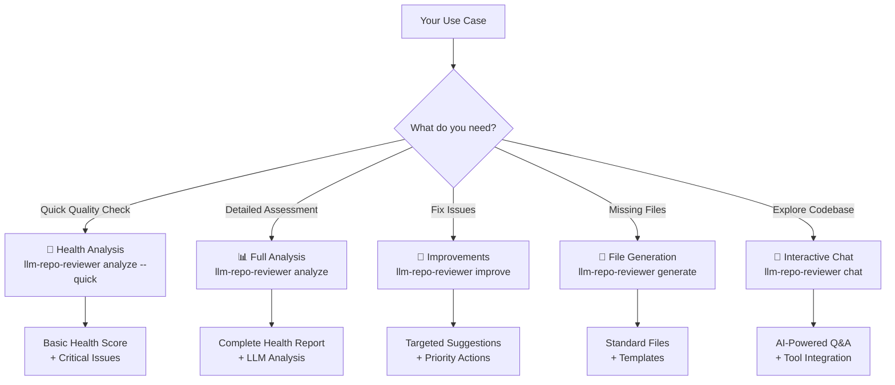
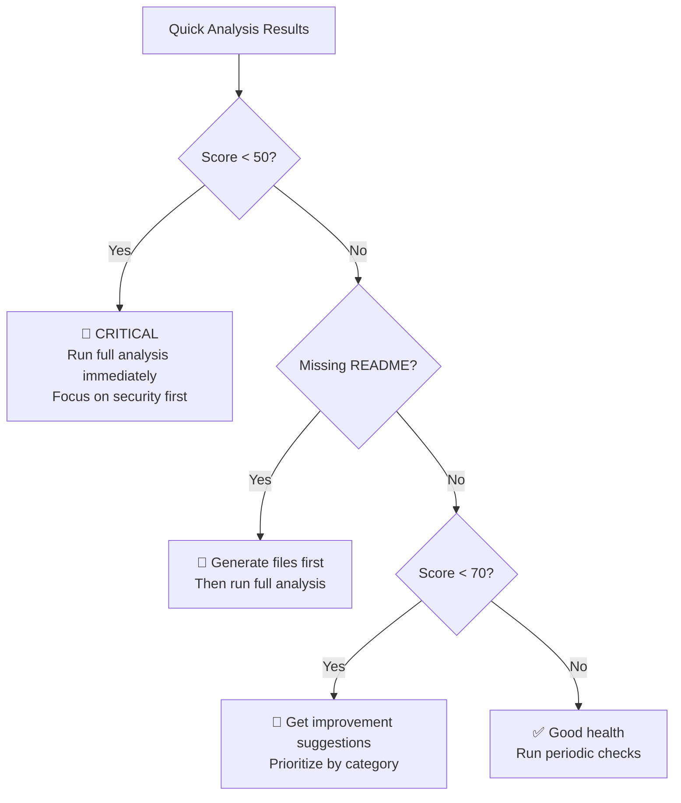
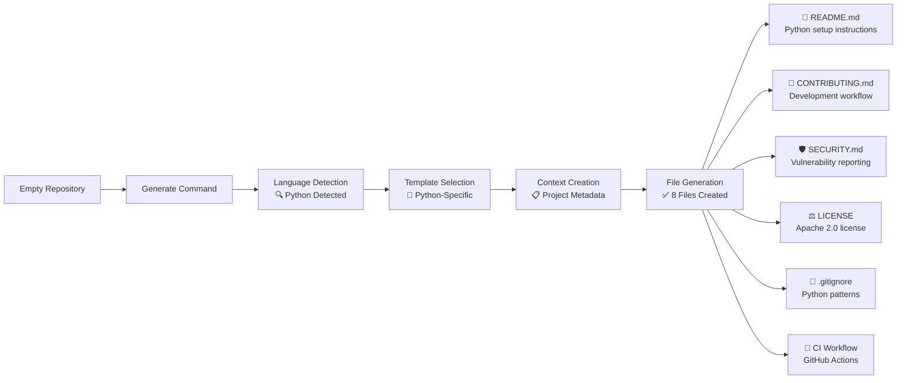
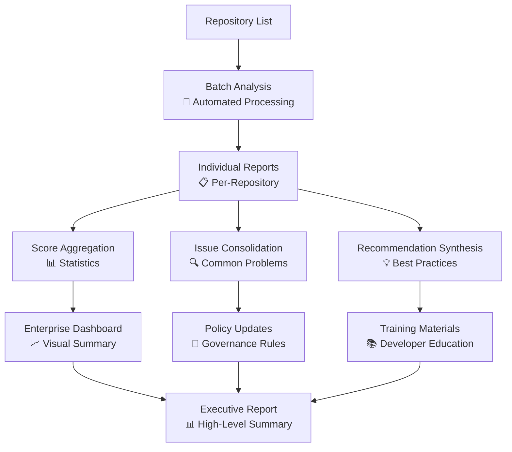
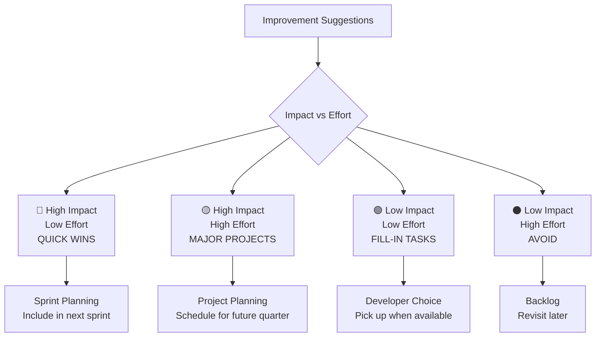
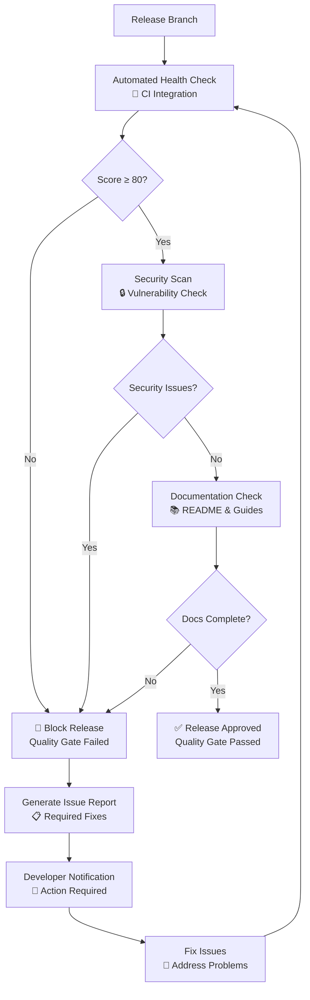
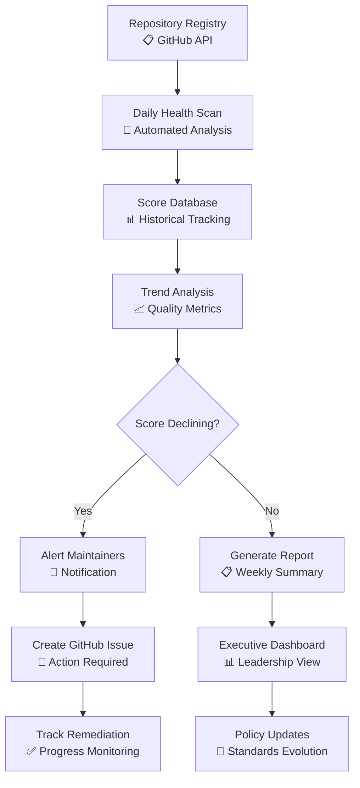
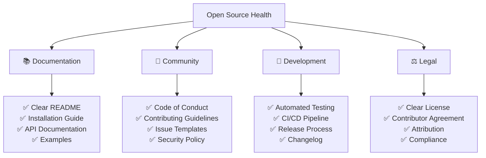
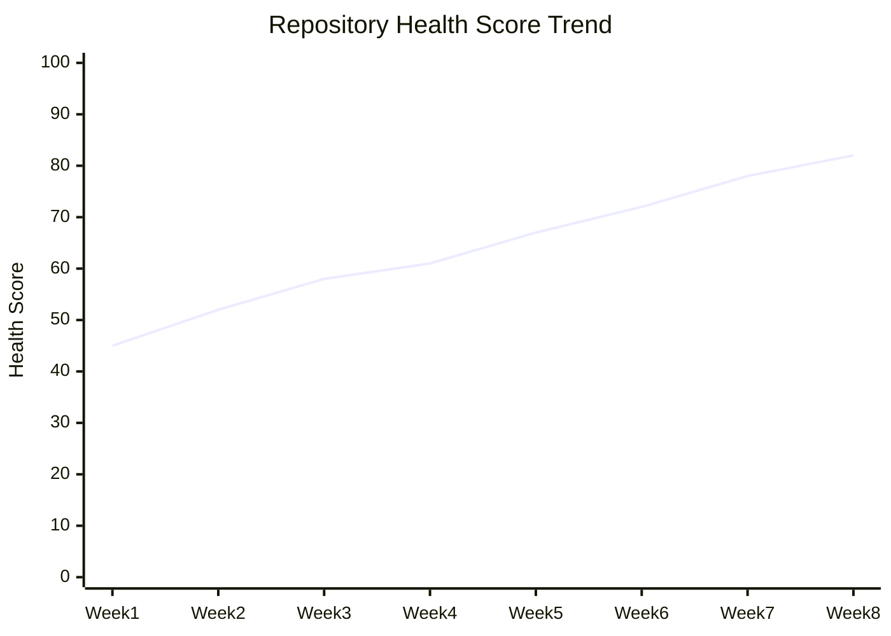

# 📚 Usage Examples & Workflows

This guide provides comprehensive examples of using the Repository Health Analyzer across different scenarios, from quick assessments to detailed enterprise-grade repository governance.

## 🎯 Quick Reference



## 🚀 Getting Started Examples

### Example 1: First-Time Repository Assessment

**Scenario**: You've inherited a codebase and need to understand its quality and gaps.

```bash
# Step 1: Quick health check (30 seconds)
llm-repo-reviewer analyze --quick

# Expected output:
# 🏥 Repository Health Score: 65/100 (C+)
# 🚨 Critical Issues: 3 found
# ⚠️ High Priority: 5 issues
# 📋 Missing Files: README.md, SECURITY.md, .gitignore
```

**Decision Tree**:


### Example 2: New Project Setup

**Scenario**: Starting a new project and want to establish best practices from day one.

```bash
# Step 1: Generate all standard files
llm-repo-reviewer generate \
  --author-name "Sarah Chen" \
  --author-email "sarah@company.com" \
  --description "Machine learning pipeline for fraud detection" \
  --license "Apache-2.0"

# Step 2: Verify what was created
llm-repo-reviewer generate --dry-run

# Step 3: Get baseline health assessment
llm-repo-reviewer analyze
```

**Generated Files Workflow**:


**Expected Results**:
```
✅ Generated Files (6):
- README.md - ✅ Created (2,847 chars)
- CONTRIBUTING.md - ✅ Created (3,156 chars)
- SECURITY.md - ✅ Created (1,923 chars)
- LICENSE - ✅ Created (11,357 chars)
- .gitignore - ✅ Created (1,456 chars)
- .github/workflows/ci.yml - ✅ Created (891 chars)

🎯 Next Steps:
1. Review and customize generated files
2. Update project-specific information (URLs, contact info, etc.)
3. Commit the new files to your repository
4. Run another health analysis to see improved scores
```

## 🏥 Health Analysis Deep Dive

### Example 3: Enterprise Repository Audit

**Scenario**: Auditing 50+ repositories for compliance and quality standards.

```bash
# Create analysis script for batch processing
cat > audit_repos.sh << 'EOF'
#!/bin/bash

# Repository list
repos=(
  "https://github.com/company/backend-api"
  "https://github.com/company/frontend-web"
  "https://github.com/company/mobile-app"
  "https://github.com/company/data-pipeline"
)

# Audit each repository
for repo in "${repos[@]}"; do
  echo "🏥 Analyzing: $repo"

  # Full health analysis with detailed report
  llm-repo-reviewer analyze "$repo" \
    --output "reports/$(basename $repo)_health_report.md" \
    --show-scores

  # Extract improvement suggestions
  llm-repo-reviewer improve "$repo" > "reports/$(basename $repo)_improvements.md"

  echo "✅ Completed: $(basename $repo)"
done

# Generate summary report
echo "📊 Generating enterprise summary..."
python generate_enterprise_summary.py reports/
EOF

chmod +x audit_repos.sh
./audit_repos.sh
```

**Enterprise Analysis Workflow**:


**Sample Enterprise Summary**:
```markdown
# 🏢 Enterprise Repository Health Summary

## 📊 Overall Metrics
- **Repositories Analyzed**: 50
- **Average Health Score**: 72/100 (B)
- **Above 80 (Good)**: 18 repositories (36%)
- **Below 50 (Critical)**: 8 repositories (16%)

## 🎯 Top Issues Across Repositories
1. **Missing Security Policies**: 34 repositories (68%)
2. **Inadequate Test Coverage**: 28 repositories (56%)
3. **Outdated Dependencies**: 31 repositories (62%)
4. **Missing CI/CD**: 19 repositories (38%)

## 💡 Recommended Actions
1. **Implement Security Policy Template** - Generate SECURITY.md for all repos
2. **Establish Testing Standards** - Minimum 70% coverage requirement
3. **Dependency Update Schedule** - Monthly automated updates
4. **CI/CD Standardization** - Deploy standard GitHub Actions workflows
```

### Example 4: Security-Focused Analysis

**Scenario**: Security audit before a major release.

```bash
# Focus specifically on security aspects
llm-repo-reviewer improve --focus-areas security

# Get detailed security analysis
llm-repo-reviewer chat
```

**Chat Session Example**:
```
🤖 Repository Health Analyzer - Interactive Mode
💬 Chat started. Type your questions about the repository.

You: Perform a comprehensive security analysis of this repository

🤖 I'll analyze the repository security using specialized tools. Let me check multiple aspects:

[Tool: analyze_repository_health(focus_areas=["security"])]

Security Analysis Results:
🔒 Security Score: 45/100 (D) - Critical Issues Found

🚨 Critical Security Issues:
1. No SECURITY.md policy file found
2. 3 potential secrets detected in configuration files
3. Dependencies with known vulnerabilities:
   - requests==2.25.1 (CVE-2023-32681)
   - django==3.1.0 (CVE-2023-31047)

[Tool: grep_content(pattern="password|secret|api_key")]

🔍 Potential Secrets Found:
- config/settings.py:12: SECRET_KEY = "django-insecure-abc123..."
- scripts/deploy.sh:8: export API_KEY="pk_live_abc123..."
- docker-compose.yml:15: POSTGRES_PASSWORD=mysecretpassword

You: Generate a security policy file for this project

[Tool: generate_missing_files(file_types=["SECURITY"], dry_run=false)]

✅ Generated SECURITY.md with:
- Vulnerability reporting process
- Supported versions table
- Security best practices
- Contact information for security team

🎯 Next Steps:
1. Move secrets to environment variables
2. Update vulnerable dependencies
3. Set up automated security scanning
4. Review and customize the generated SECURITY.md
```

## 🔧 Improvement & Maintenance Workflows

### Example 5: Technical Debt Reduction

**Scenario**: Monthly technical debt review and cleanup.

```bash
# Get comprehensive improvement suggestions
llm-repo-reviewer improve > monthly_improvements.md

# Focus on specific areas based on team capacity
llm-repo-reviewer improve --focus-areas testing documentation
```

**Improvement Prioritization Matrix**:


**Sample Improvement Output**:
```markdown
# Repository Improvement Suggestions

**Current Health Score**: 68/100

## 🚨 Critical Actions Required
- 🚨 CRITICAL: Address security vulnerabilities immediately
- 🚨 CRITICAL: Create README.md file

## 📝 Missing Standard Files (5)
- **CONTRIBUTING.md** ✅ (Template available)
- **SECURITY.md** ✅ (Template available)
- **CHANGELOG.md** ✅ (Template available)
- **.github/workflows/ci.yml** ✅ (Template available)
- **.gitignore** ✅ (Template available)

## 🔧 File Improvements
### src/main.py 🔴
**Remove Hardcoded Secrets**
Move API keys and passwords to environment variables

### tests/ directory 🟡
**Improve Test Coverage**
Current coverage: 45% - Target: 70%+
Add tests for: authentication, error handling, edge cases

### docs/ directory 🟢
**Add API Documentation**
Generate OpenAPI specs and usage examples

## 📊 Category Recommendations
- **Security** 🔴 (45/100): Implement security best practices
- **Documentation** 🟡 (62/100): Improve project documentation
- **Testing** 🟡 (58/100): Enhance test coverage and quality
```

### Example 6: Pre-Release Quality Gate

**Scenario**: Ensuring repository quality before a major release.

**Quality Gate Workflow**:


**CI Integration Example** (`.github/workflows/quality-gate.yml`):
```yaml
name: Quality Gate

on:
  pull_request:
    branches: [main, release/*]

jobs:
  health-check:
    runs-on: ubuntu-latest
    steps:
      - uses: actions/checkout@v4

      - name: Install Repository Health Analyzer
        run: pip install llm-repo-reviewer

      - name: Run Health Analysis
        run: |
          llm-repo-reviewer analyze --quick --output health-report.md

      - name: Check Minimum Score
        run: |
          score=$(grep "Overall Health Score" health-report.md | grep -o '[0-9]\+')
          if [ "$score" -lt 80 ]; then
            echo "❌ Quality gate failed: Score $score < 80"
            exit 1
          else
            echo "✅ Quality gate passed: Score $score ≥ 80"
          fi

      - name: Upload Health Report
        uses: actions/upload-artifact@v3
        with:
          name: health-report
          path: health-report.md
```

## 💬 Interactive Chat Examples

### Example 7: Code Exploration & Understanding

**Scenario**: New team member trying to understand a complex codebase.

```bash
# Start interactive session
llm-repo-reviewer chat /path/to/complex-project
```

**Chat Session - Architecture Understanding**:
```
🤖 Ready to explore the repository. Ask me anything!

You: What is this project about and what does it do?

🤖 [Tool: analyze_repository_health(analysis_depth="standard")]

This appears to be a distributed microservices e-commerce platform. Based on my analysis:

**Project Purpose**: Multi-tenant e-commerce platform with microservices architecture
**Primary Language**: Python (67%), JavaScript (22%), Go (11%)
**Architecture**:
- 12 microservices (user, product, order, payment, inventory, etc.)
- Event-driven communication via Apache Kafka
- PostgreSQL for transactional data, Redis for caching
- Kubernetes deployment with Helm charts

**Key Components**:
- API Gateway (Kong) for request routing
- Authentication service using JWT tokens
- Payment processing via Stripe integration
- Real-time notifications via WebSocket

You: Show me the main entry points and how services communicate

🤖 [Tool: find_files(pattern="**/main.py")]
[Tool: find_files(pattern="**/app.py")]
[Tool: grep_content(pattern="@app.route|@api.route")]

**Main Entry Points Found**:
1. `services/api-gateway/main.py` - Primary API entry point
2. `services/user-service/app.py` - User management
3. `services/product-service/app.py` - Product catalog
4. `services/order-service/app.py` - Order processing

**Service Communication Patterns**:
- REST APIs for synchronous communication
- Kafka topics for async events:
  - `user.created`, `order.placed`, `payment.processed`
- Service discovery via Kubernetes DNS
- Circuit breakers using Hystrix pattern

You: Are there any security concerns I should know about?

🤖 [Tool: analyze_repository_health(focus_areas=["security"])]
[Tool: grep_content(pattern="password|secret|token")]

**Security Assessment** 🔒:

🚨 **Critical Issues**:
1. Hardcoded JWT secret in `config/settings.py:45`
2. Database password in plain text in `docker-compose.yml`
3. Missing input validation in payment endpoints

⚠️ **Medium Issues**:
- No rate limiting on authentication endpoints
- Missing CORS configuration
- Outdated dependencies with known vulnerabilities

✅ **Good Practices**:
- SQL injection protection via SQLAlchemy ORM
- HTTPS enforcement in production
- API key rotation mechanism implemented

**Immediate Actions Required**:
1. Move secrets to environment variables
2. Implement rate limiting (recommended: 100 req/min per IP)
3. Add input validation for payment amounts
4. Update vulnerable packages: `requests`, `pillow`, `django`
```

### Example 8: Debugging & Troubleshooting

**Scenario**: Production issue investigation.

```
You: We're seeing high memory usage in production. Can you help me find potential memory leaks?

🤖 [Tool: grep_content(pattern="memory|leak|cache|@lru_cache")]
[Tool: find_files(pattern="**/*profile*.py")]

**Memory Analysis** 🧠:

**Potential Memory Issues Found**:

1. **Unbounded Cache in user_service.py:234**
   ```python
   user_cache = {}  # Never cleared, grows indefinitely
   ```
   **Fix**: Implement LRU cache with size limit

2. **Large DataFrame Operations in analytics.py:156**
   ```python
   df = pd.read_csv(large_file)  # Loading 2GB+ files
   ```
   **Fix**: Process in chunks or use Dask for larger datasets

3. **Event Listener Memory Leak in event_handler.py:89**
   ```python
   # Event listeners not properly cleaned up
   ```
   **Fix**: Implement proper cleanup in finally blocks

**Recommendations**:
- Add memory monitoring with `memory_profiler`
- Implement cache size limits and TTL
- Use context managers for resource cleanup
- Consider implementing backpressure in Kafka consumers

You: Generate a monitoring setup for tracking memory usage

🤖 [Tool: generate_missing_files(file_types=["monitoring"])]

I'll create a comprehensive monitoring setup for memory tracking:

**Generated Files**:
1. `monitoring/memory_monitor.py` - Memory tracking utilities
2. `monitoring/metrics.py` - Prometheus metrics collection
3. `docker-compose.monitoring.yml` - Grafana + Prometheus setup
4. `monitoring/dashboard.json` - Pre-configured Grafana dashboard

**Memory Monitoring Features**:
- Real-time memory usage per service
- Memory leak detection alerts
- Garbage collection metrics
- Cache hit/miss ratios
- Custom memory profiling decorators

**Alert Configuration**:
- Memory usage > 80%: Warning
- Memory usage > 95%: Critical
- Memory growth rate > 10MB/hour: Investigation needed
```

## 🎯 Advanced Use Cases

### Example 9: Multi-Repository Governance

**Scenario**: Managing code quality across 100+ repositories in a large organization.

**Governance Automation Pipeline**:


**Governance Script Example**:
```python
#!/usr/bin/env python3
"""
Enterprise Repository Governance System
Monitors health across all organization repositories
"""

import asyncio
import subprocess
from datetime import datetime
from github import Github

class EnterpriseGovernance:
    def __init__(self, github_token: str):
        self.github = Github(github_token)
        self.org = self.github.get_organization("your-org")

    async def scan_all_repositories(self):
        """Scan all organization repositories for health"""
        results = []

        for repo in self.org.get_repos():
            if not repo.archived:  # Skip archived repos
                print(f"🏥 Scanning: {repo.name}")

                # Run health analysis
                result = subprocess.run([
                    "llm-repo-reviewer", "analyze", "--quick",
                    f"https://github.com/{repo.full_name}",
                    "--output", f"reports/{repo.name}_health.md"
                ], capture_output=True, text=True)

                # Extract score from output
                score = self.extract_score(result.stdout)

                results.append({
                    "repo": repo.name,
                    "score": score,
                    "last_updated": repo.updated_at,
                    "language": repo.language,
                    "stars": repo.stargazers_count
                })

        return results

    def generate_governance_report(self, results):
        """Generate enterprise governance report"""
        report = f"""
# 🏢 Enterprise Repository Health Report
**Generated**: {datetime.now().strftime('%Y-%m-%d %H:%M')}
**Repositories Scanned**: {len(results)}

## 📊 Health Distribution
{self.generate_score_distribution(results)}

## 🚨 Action Required (Score < 60)
{self.generate_critical_repos(results)}

## 🎯 Recommendations
{self.generate_recommendations(results)}
"""
        return report

# Usage
governance = EnterpriseGovernance("your-github-token")
results = asyncio.run(governance.scan_all_repositories())
report = governance.generate_governance_report(results)
```

### Example 10: Open Source Project Health

**Scenario**: Maintaining a popular open source project with multiple contributors.

```bash
# Comprehensive health check for open source project
llm-repo-reviewer analyze \
  --generate-files \
  --author-name "OSS Maintainer" \
  --author-email "maintainer@project.org"

# Check community health specifically
llm-repo-reviewer improve --focus-areas community

# Generate missing community files
llm-repo-reviewer generate --files \
  CONTRIBUTING CODE_OF_CONDUCT SECURITY \
  ISSUE_TEMPLATE PULL_REQUEST_TEMPLATE
```

**Open Source Health Checklist**:


**Community Health Output**:
```markdown
# 👥 Community Health Assessment

**Overall Community Score**: 78/100 (B+)

## ✅ Strengths
- Active contributor community (47 contributors)
- Clear contributing guidelines
- Responsive issue triage (average 2.3 days)
- Good documentation coverage

## 🎯 Areas for Improvement

### Missing Community Files
- **CODE_OF_CONDUCT.md** - Establish community standards
- **SECURITY.md** - Vulnerability reporting process
- **SUPPORT.md** - Help and support resources

### Enhancement Opportunities
- **Issue Templates** - Standardize bug reports and feature requests
- **PR Templates** - Improve pull request quality
- **Governance** - Document decision-making process
- **Roadmap** - Public development roadmap

## 📋 Generated Files Preview
✅ CODE_OF_CONDUCT.md (1,847 chars) - Contributor Covenant v2.1
✅ SECURITY.md (1,203 chars) - Vulnerability reporting process
✅ .github/ISSUE_TEMPLATE/bug_report.md (891 chars)
✅ .github/ISSUE_TEMPLATE/feature_request.md (734 chars)
✅ .github/PULL_REQUEST_TEMPLATE.md (567 chars)

## 🎯 Next Steps
1. Review and customize generated community files
2. Announce new community guidelines to contributors
3. Set up GitHub Discussions for community support
4. Create project roadmap and milestones
5. Establish regular community meetings or updates
```

## 📈 Monitoring & Continuous Improvement

### Example 11: Health Score Tracking Over Time

**Setup Continuous Monitoring**:
```bash
# Create weekly health monitoring cron job
crontab -e

# Add entry:
# 0 9 * * 1 /path/to/weekly-health-check.sh
```

**Weekly Health Check Script**:
```bash
#!/bin/bash
# weekly-health-check.sh

DATE=$(date +%Y-%m-%d)
REPO_PATH="/path/to/your/project"
REPORTS_DIR="health-tracking"

mkdir -p "$REPORTS_DIR"

echo "🏥 Weekly Repository Health Check - $DATE"

# Run health analysis
llm-repo-reviewer analyze "$REPO_PATH" \
  --output "$REPORTS_DIR/health-$DATE.md" \
  --show-scores

# Extract score for trending
SCORE=$(grep -o "Overall Health Score: [0-9]\+" "$REPORTS_DIR/health-$DATE.md" | grep -o "[0-9]\+")

# Log to CSV for tracking
echo "$DATE,$SCORE" >> "$REPORTS_DIR/health-scores.csv"

# Generate trend analysis
python generate-health-trends.py "$REPORTS_DIR/health-scores.csv"

echo "✅ Health check complete. Score: $SCORE/100"
```

**Health Trend Visualization**:


---

## 🎯 Best Practices Summary

### Command Selection Guide

| Scenario | Recommended Command | Options |
|----------|-------------------|---------|
| **Quick Assessment** | `analyze --quick` | Fast overview |
| **Detailed Audit** | `analyze` | Full LLM analysis |
| **Fix Specific Issues** | `improve --focus-areas X` | Targeted fixes |
| **New Project Setup** | `generate` then `analyze` | Best practices |
| **Code Exploration** | `chat` | Interactive discovery |
| **CI/CD Integration** | `analyze --quick --no-prompt` | Automated checks |
| **Enterprise Governance** | Batch scripts with `analyze` | Scale analysis |

### Workflow Recommendations

1. **New Projects**: Generate → Analyze → Improve
2. **Existing Projects**: Analyze → Improve → Generate missing
3. **Code Reviews**: Quick analyze for PR quality gates
4. **Maintenance**: Regular improve sessions for technical debt
5. **Exploration**: Chat mode for understanding complex codebases

### Integration Patterns

- **CI/CD**: Quality gates with score thresholds
- **Code Reviews**: Automated health checks on PRs
- **Monitoring**: Weekly health score tracking
- **Governance**: Cross-repository compliance scanning
- **Onboarding**: Interactive exploration for new team members

The Repository Health Analyzer adapts to your workflow, providing the right level of analysis for each situation while maintaining consistency and quality across your codebase ecosystem.
