# 🔧 Tools Documentation

The Repository Health Analyzer provides a comprehensive suite of tools that enable the AI to perform detailed repository analysis. These tools are organized into three main categories: Health Analysis Tools, File System Tools, and the underlying Tool Registry system.

## 🏗️ Tool Architecture

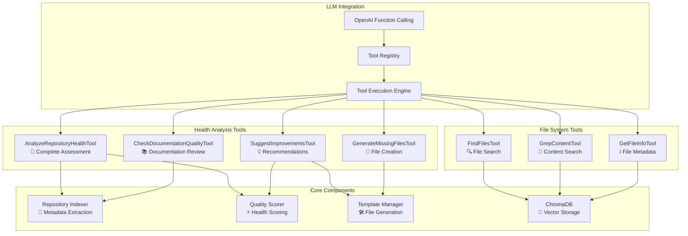

## 🏥 Health Analysis Tools

These specialized tools provide comprehensive repository assessment capabilities that the LLM can invoke to analyze different aspects of repository health.

### 1. AnalyzeRepositoryHealthTool

**Purpose**: Performs complete health assessment with detailed scoring across all 6 categories.

**Function Schema**:
```json
{
  "name": "analyze_repository_health",
  "description": "Perform comprehensive health analysis of a repository and return detailed scores",
  "parameters": {
    "type": "object",
    "properties": {
      "repo_path": {
        "type": "string",
        "description": "Path to the repository to analyze"
      },
      "analysis_depth": {
        "type": "string",
        "enum": ["quick", "standard", "deep"],
        "description": "Depth of analysis to perform",
        "default": "standard"
      },
      "focus_areas": {
        "type": "array",
        "items": {"type": "string"},
        "description": "Specific areas to focus on (documentation, security, testing, etc.)",
        "default": []
      }
    },
    "required": ["repo_path"]
  }
}
```

**Analysis Workflow**:
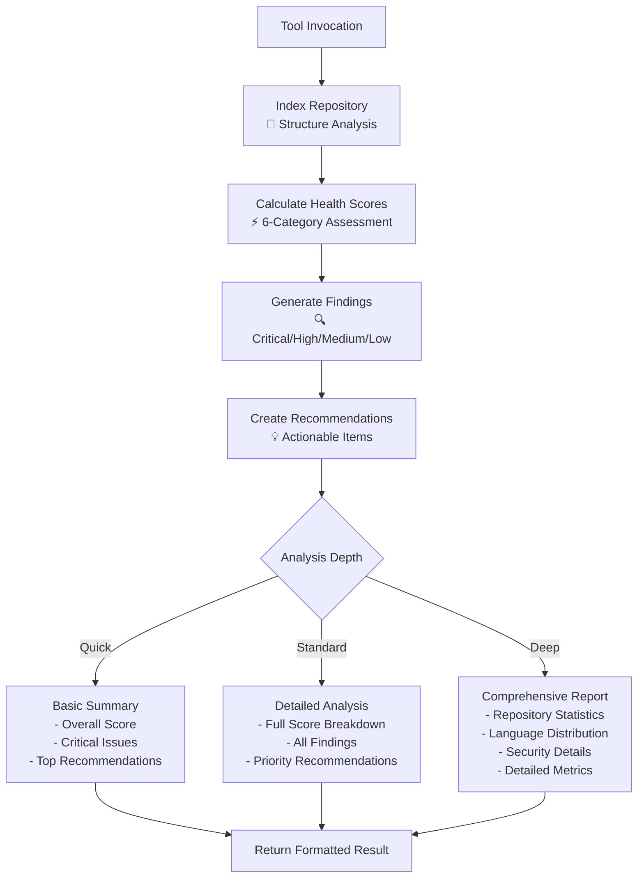

**Example Usage**:
```python
# LLM can call this tool during conversation
result = analyze_repository_health(
    repo_path="/path/to/repo",
    analysis_depth="deep",
    focus_areas=["security", "testing"]
)
```

### 2. CheckDocumentationQualityTool

**Purpose**: Specialized assessment of documentation quality and completeness.

**Function Schema**:
```json
{
  "name": "check_documentation_quality",
  "description": "Analyze README, API docs, and project documentation quality",
  "parameters": {
    "type": "object",
    "properties": {
      "repo_path": {
        "type": "string",
        "description": "Path to the repository",
        "default": "."
      },
      "check_completeness": {
        "type": "boolean",
        "description": "Check for missing documentation files",
        "default": true
      },
      "language_specific": {
        "type": "boolean",
        "description": "Include language-specific documentation recommendations",
        "default": true
      }
    },
    "required": ["repo_path"]
  }
}
```

**Documentation Assessment Process**:
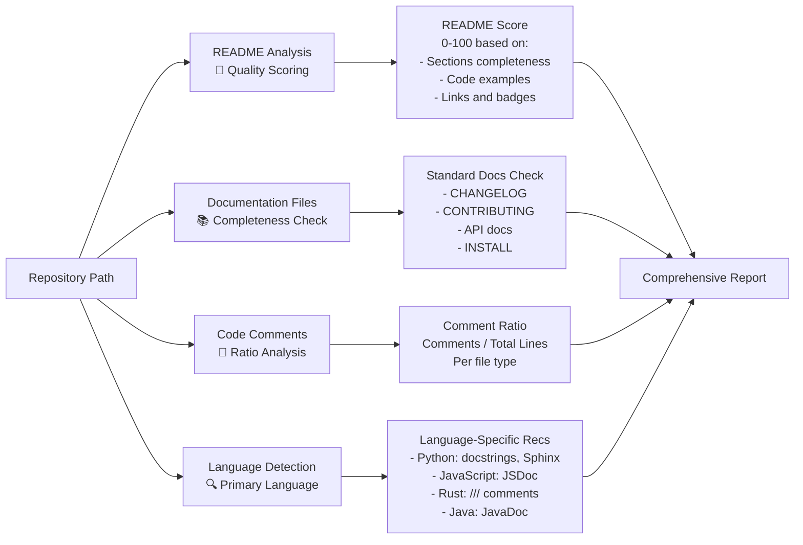

### 3. SuggestImprovementsTool

**Purpose**: Generate actionable improvement suggestions based on health assessment.

**Function Schema**:
```json
{
  "name": "suggest_improvements",
  "description": "Generate actionable improvement suggestions for repository health",
  "parameters": {
    "type": "object",
    "properties": {
      "repo_path": {
        "type": "string",
        "description": "Path to the repository",
        "default": "."
      },
      "priority_areas": {
        "type": "array",
        "items": {"type": "string"},
        "description": "Areas to prioritize (security, documentation, testing, etc.)",
        "default": []
      },
      "include_templates": {
        "type": "boolean",
        "description": "Include information about available templates",
        "default": true
      }
    },
    "required": ["repo_path"]
  }
}
```

**Improvement Generation Flow**:
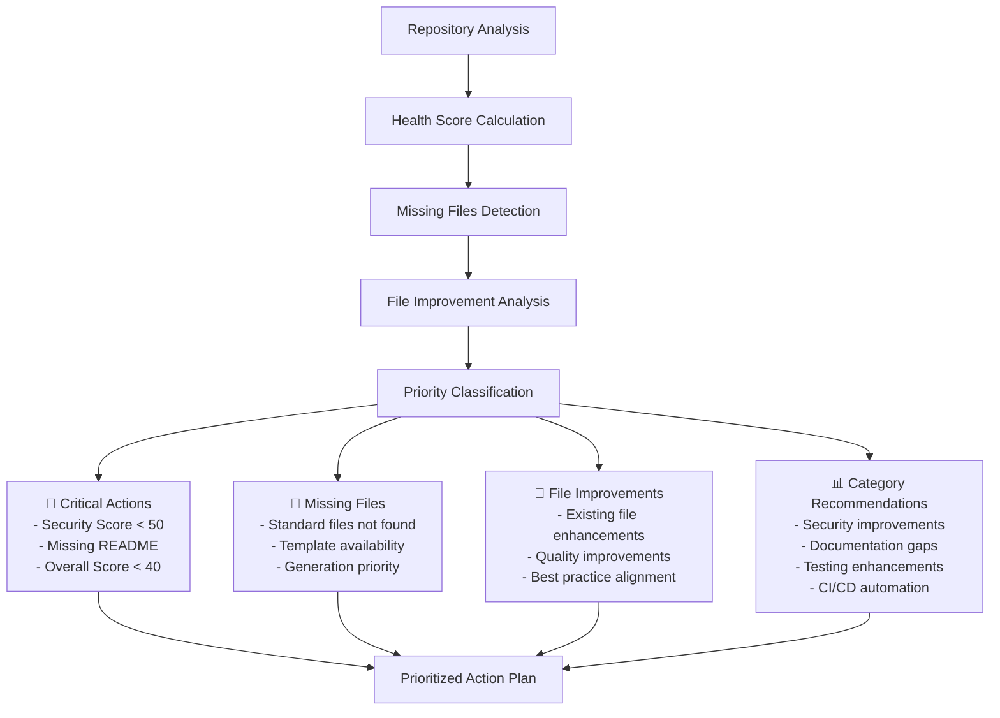

### 4. GenerateMissingFilesTool

**Purpose**: Create templates for missing standard repository files.

**Function Schema**:
```json
{
  "name": "generate_missing_files",
  "description": "Create templates for missing standard repository files",
  "parameters": {
    "type": "object",
    "properties": {
      "repo_path": {
        "type": "string",
        "description": "Path to the repository",
        "default": "."
      },
      "file_types": {
        "type": "array",
        "items": {"type": "string"},
        "description": "Specific file types to generate (README, CONTRIBUTING, etc.)",
        "default": []
      },
      "customize_for_language": {
        "type": "boolean",
        "description": "Customize templates for the repository's primary language",
        "default": true
      },
      "dry_run": {
        "type": "boolean",
        "description": "Preview what would be generated without creating files",
        "default": true
      }
    },
    "required": ["repo_path"]
  }
}
```

**Template Generation System**:
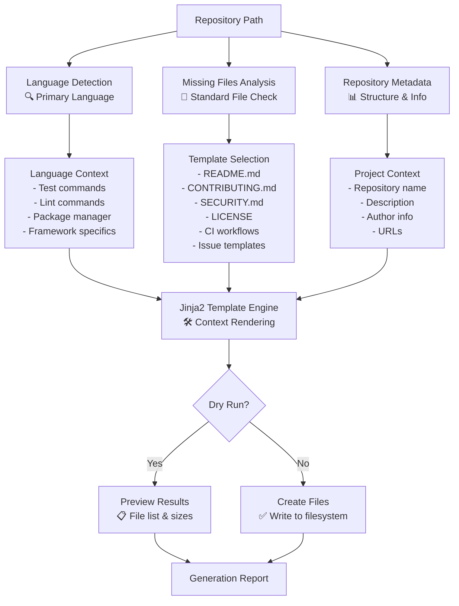

## 📁 File System Tools

These tools provide the AI with precise file system access capabilities for detailed repository exploration.

### 1. FindFilesTool

**Purpose**: Search for files by name patterns using glob syntax.

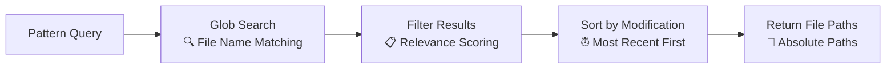

**Example Patterns**:
- `**/*.py` - All Python files
- `**/test_*.py` - All test files
- `src/**/*.ts` - TypeScript files in src
- `*.md` - Markdown files in root
- `**/*config*` - Configuration files

### 2. GrepContentTool

**Purpose**: Search file contents using regular expressions.

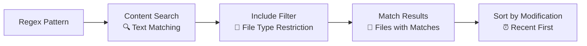

**Example Patterns**:
- `TODO|FIXME|HACK` - Technical debt markers
- `password|secret|api_key` - Potential secrets
- `def\s+test_.*` - Python test functions
- `class\s+\w+Test` - Test classes
- `@Injectable|@Component` - Angular decorators

### 3. GetFileInfoTool

**Purpose**: Retrieve detailed metadata and statistics for files.

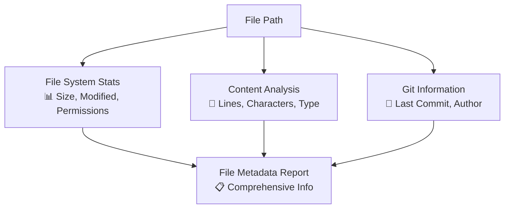

**Information Provided**:
- File size and last modified date
- Line count and character count
- File type and encoding
- Git blame information
- Directory structure context

## 🔄 Tool Registry System

The tool registry manages all available tools and provides the interface between the LLM and tool implementations.

### Registry Architecture

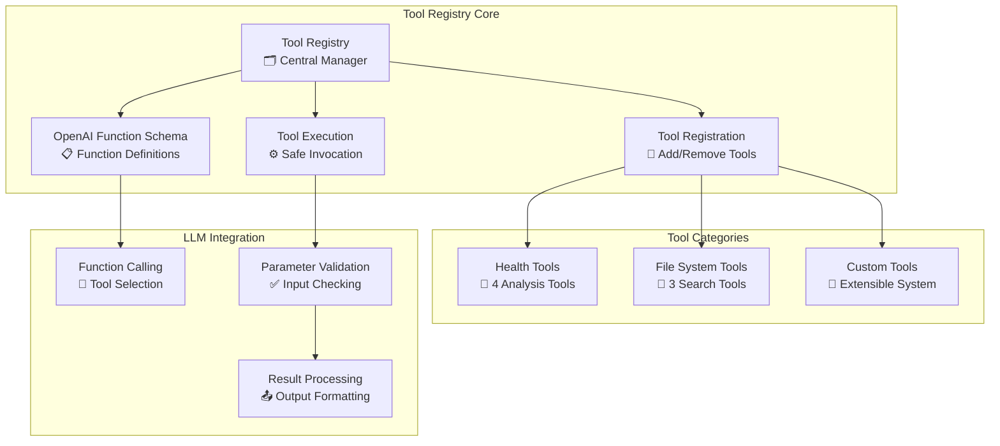

### Tool Registration Process

```python
# Tools are automatically registered at startup
from .tools.health_tools import health_tools
from .tools.file_tools import file_tools

# Registry maintains tool instances
registry = ToolRegistry()
for tool in health_tools + file_tools:
    registry.register(tool)

# OpenAI function schemas are generated automatically
functions = registry.get_openai_functions()
```

### Function Calling Flow

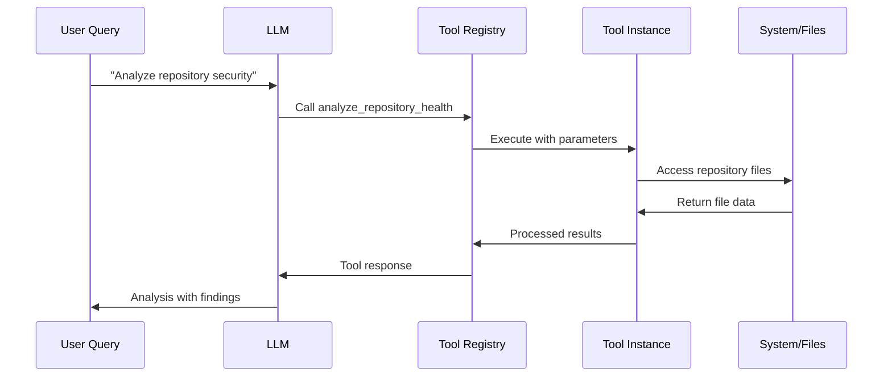

## 🛠️ Tool Development

### Creating Custom Tools

Tools implement the `BaseTool` interface:

```python
from .base import BaseTool

class CustomAnalysisTool(BaseTool):
    name = "custom_analysis"
    description = "Perform custom repository analysis"

    @property
    def parameters(self) -> Dict[str, Any]:
        return {
            "type": "object",
            "properties": {
                "repo_path": {
                    "type": "string",
                    "description": "Repository path"
                }
            },
            "required": ["repo_path"]
        }

    def execute(self, **kwargs) -> str:
        # Tool implementation
        return "Analysis results"
```

### Tool Integration

```python
# Register custom tool
analyzer = RepoHealthAnalyzer()
analyzer.register_tool(CustomAnalysisTool())

# Tool becomes available to LLM
# User: "Run custom analysis on this repo"
# LLM: *calls custom_analysis tool automatically*
```

## 📊 Tool Performance

### Execution Metrics

| Tool Category | Average Execution Time | Memory Usage | Typical Output Size |
|---------------|------------------------|--------------|-------------------|
| Health Analysis | 2-5 seconds | 50-100MB | 5-50KB text |
| Documentation Check | 1-2 seconds | 10-20MB | 2-10KB text |
| File Search | 0.1-0.5 seconds | 5-10MB | 1-5KB text |
| Content Grep | 0.5-2 seconds | 10-30MB | 2-20KB text |

### Optimization Features

- **Caching**: Results cached in ChromaDB for repeated queries
- **Indexing**: Repository metadata pre-indexed for fast access
- **Streaming**: Large results can be streamed for better UX
- **Parallelization**: Multiple tools can execute concurrently
- **Timeouts**: All tool executions have configurable timeouts

## 🔍 Tool Usage Examples

### Health Analysis Scenario

```
User: "Analyze the security of this Python project"

LLM Decision Making:
1. Detects security focus requirement
2. Calls analyze_repository_health with focus_areas=["security"]
3. Calls check_documentation_quality for security docs
4. Calls suggest_improvements with priority_areas=["security"]

Tool Execution:
- analyze_repository_health: Scans for vulnerabilities, secrets, policies
- check_documentation_quality: Looks for SECURITY.md, security sections
- suggest_improvements: Generates security-focused recommendations

Result: Comprehensive security assessment with specific action items
```

### File Generation Scenario

```
User: "This repository is missing standard community files"

LLM Decision Making:
1. Calls analyze_repository_health for overview
2. Calls generate_missing_files with dry_run=true
3. Based on results, asks user for confirmation
4. Calls generate_missing_files with dry_run=false

Tool Execution:
- Identifies missing: CONTRIBUTING.md, CODE_OF_CONDUCT.md, SECURITY.md
- Generates language-appropriate templates
- Creates files with project-specific context

Result: Repository enhanced with standard community health files
```

## 🚨 Error Handling

### Tool Execution Safety

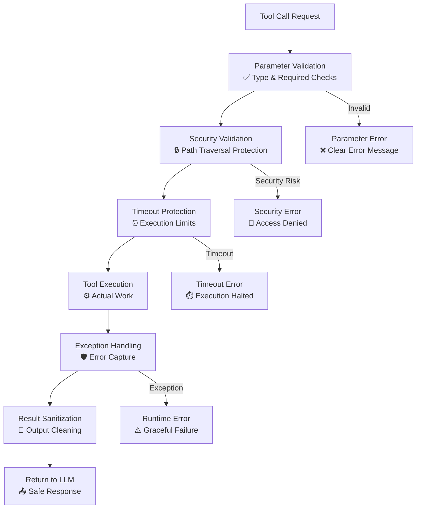

### Common Error Scenarios

1. **File Not Found**: Graceful handling with suggestions
2. **Permission Denied**: Clear error with resolution steps
3. **Timeout**: Partial results with continuation options
4. **Memory Limits**: Streaming or chunked processing
5. **Invalid Patterns**: Pattern validation with examples

---

The tool system forms the backbone of the Repository Health Analyzer's intelligent analysis capabilities, providing the LLM with precise, safe, and powerful repository exploration abilities.
